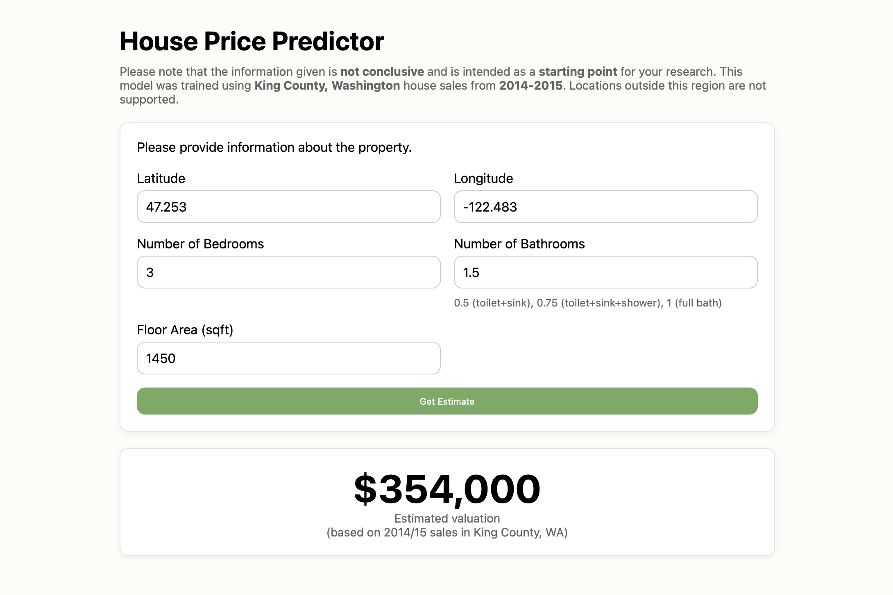

# House Price Predictor

[House Price Predictor](https://house-price-predictor-wg9u.onrender.com) is a web application that estimates the value of a house using a machine learning model. Users enter a few basic details and receive an instant price prediction.

> **Note:** This model is trained on properties sold in King County, WA (2014/15). Houses outside of this region are not supported.

<p align="center">
    
</p>

## Tech Stack

- Python
- FastAPI
- scikit-learn
- Pandas
- Docker
- HTML / CSS / JavaScript

## Run with Docker

```bash
docker build -t house-price-predictor .
docker run -p 8000:8000 house-price-predictor
```

The model is trained automatically during the Docker build process.

View the site at http://localhost:8000 


## Run Without Docker

Create and activate a virtual environment
```bash
python3.12 -m venv venv
source venv/bin/activate
```

Install dependencies
```bash
pip install -r requirements.txt
```

Run the backend application
```bash
fastapi run app/main.py --reload
```

Then open http://localhost:8000 in a web browser.

## Further Improvements

This project is a proof of concept demonstrating end-to-end deployment of a machine learning model. Potential improvements include:
- Training a model on a dataset covering a larger geographic region.
- Splitting the bathroom input into clearer categories (full, half, ensuite) to reduce ambiguity.
- Adding zipcode geocoding so users can input a zipcode instead of coordinates.